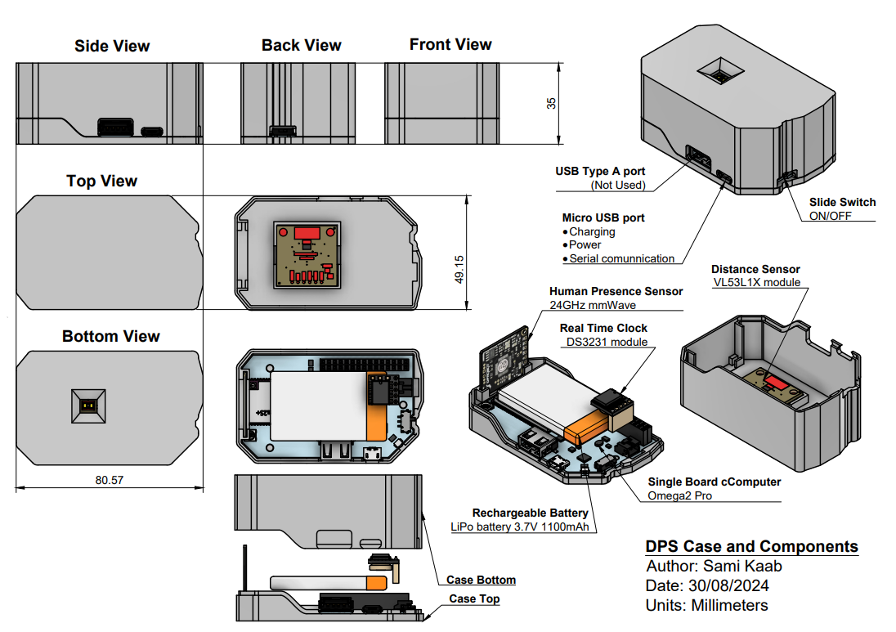

<!-- add a link to go back to main readme file -->
## [🏠 HOME](../README.md) | [🔧 Firmware](./README.md) | [💻 Software](../Software/README.md) | [📊 Analysis](../Analysis/README.md)

## Required material
- [Omega2 Pro](https://onion.io/store/omega2-pro/)
- [DFRobot_mmWave module](https://www.dfrobot.com/product-2282.html)
- [PiicoDev_VL53L1X module](https://www.sparkfun.com/products/14722)
- [SDL_DS3231 module](https://www.jaycar.com.au/rtc-clock-module-for-raspberry-pi/p/XC9044?pos=1&queryId=f5734bdf10cb6c5024d07c37201f1d5b&sort=relevance&searchText=rtc)
- [LiPo battery 3.7V 1100mAh](https://core-electronics.com.au/polymer-lithium-ion-battery-1000mah-38458.html)
- 5 x Male to Female Jumper wires
- 2 x Male to QWIIC Jumper wires (4-pin)
- USB A to micro USB cable

## Hardware setup
Once you have all the necessary components, you can start assembling the hardware. The wiring schematic below shows how to connect the various components to the Omega2 Pro. 

<p align="center">
  
  
</p>

You will need to 3d print a case to house the components and the frame to attach the device to the desk. The STL files can be found in the [CAD folder](../Documentation/CAD/). Make sure to print one of each of the following files:
- [Case Bottom](../Documentation/CAD/case_bottom.obj)
- [Case Top](../Documentation/CAD/case_top.obj)
- [Frame](../Documentation/CAD/frame.obj)
- [Clamping Part](../Documentation/CAD/clamping_part.obj)
  

## Setting up the Omega2 Pro
The Omega2 Pro is a headless device, meaning that it does not have a screen or keyboard. In order to set it up you need to connect it to a computer using a micro USB cable and connect to it using a serial terminal.
The device requires internet access in order to install the necessary packages.

```sh
wifisetup add -ssid <ssid> -encr psk2 -password <password>
```

Replace ssid and password with the name and password of your wifi network.
You should now have internet access, which you can verify by pinging a website:

```sh
ping duckduckgo.com
```

We first need to install git and ca-bundle in order to be able to clone the repository:
```sh
opkg update && opkg install git git-http ca-bundle
```
We can now install the necessary Omega2 and python packages. Clone the Firmware folder in the repository from the root folder:

```sh
cd /root && git init && git config core.sparseCheckout true && echo Firmware/ >> .git/info/sparse-checkout 
```
```sh
git remote add origin https://github.com/NeuroRehack/Desk-Positioning-System.git && git pull origin master
```
then navigate to the Firmware folder and run the setup script which will install the necessary packages and set up the Omega2 to run the program on startup.
```sh
cd /root/Firmware && source /root/Firmware/shell_scripts/set_up.sh
```
Next run the omega_rename script:
```sh
source ./shell_scripts/omega_rename.sh
```
This script will amongst other things change the default wifi name and password of the omega as well as the device's password.  
The device should now be ready for use. Just restart it using ```reboot``` and it should start running the program on startup.

## Setting up a google drive API
The data recorded is uploaded to a google drive using the google drive api. For the program to use the api it is necessary to generate a credentials file.
You can find instructions on how to set up a google drive api [here](https://developers.google.com/drive/api/quickstart/python).  
Since we are using a headless device it is not possible for us to generate tokens which are necessary when using a normal google account and require a webbrowser based authentification which we cannot perform. For this reason make sure to link a google service account to the project.
Once you have generated the credentials file, copy it to the Firmware folder on the Omega2 Pro and rename it "credentials.json". You will also need it for accessing the google drive using the drive_cloner.py script from your computer.