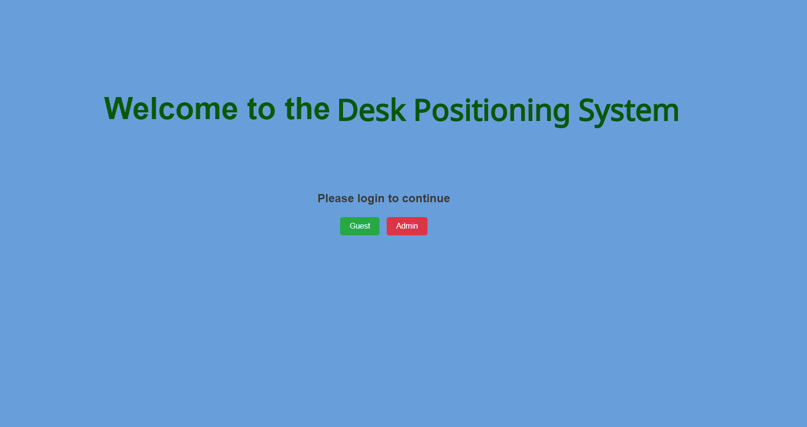

## [🏠 HOME](./README.md) | [🔧 Firmware](Firmware/README.md) | [💻 Software](Software/README.md) | [📊 Analysis](Analysis/README.md)
# Desk Positioning System 

This project aims to monitor the usage of a standing desk by measuring its height and detecting whether someone is present. The Desk Positioning System utilizes an Omega2 Pro SBC (Single-Board Computer) to read data from a human presence sensor and a distance sensor, storing this data localy. The data is periodically uploaded to Google Drive for easy remote access and analysis.

  
  

## Features
- **Desk Height Monitoring:** A laser distance sensor measures the distance between the desk and the floor, enabling the system to determine whether the desk is in a sitting or standing position.
- **Human Presence Detection:** An mmWave human presence detector identifies if a person is present and whether they are standing or sitting in front of the desk.
- **Data Logging:** Data from the sensors is processed and recorded by the Omega2 Pro, and timestamped using a real-time clock (RTC) module. The data is saved locally and periodically uploaded to Google Drive.
- **Power Management:** Powered by a rechargeable LiPo battery, the system remains operational during power outages.
- **Wi-Fi Connectivity:** The device uploads data to Google Drive when an internet connection is available. In case of network failure, data is stored locally for later upload.
- **Web Interface:** Each device hosts a unique web interface accessible via a specific URL, allowing users to:
  - Configure device settings (e.g., sampling frequency)
  - Start/stop data recording
  - Visualize recorded data in real-time
  - Manage Wi-Fi settings and monitor battery status
- **LED Indicator:** Provides visual feedback on operational status, such as internet connectivity and recording activity.
  

  

## Repo Overview
- **Firmware:** Contains the code running on the Omega2 Pro, responsible for data collection, processing, and cloud synchronization.
- **Software:** Includes scripts for downloading data from Google Drive
- **Analysis:** Provides instructions for analyzing the collected data to understand desk usage patterns.

## Getting Started
### Assembly and Setup

Follow the instructions in the [Firmware README](Firmware/README.md) to assemble the hardware and install the necessary firmware.

## Software

The scripts in software can be used to navigate, download and delete data from the google drive. For more information see the [Software README](Software/README.md).
## Data Analysis

The data collected by the Desk Positioning System can be analyzed to understand desk usage patterns. Detailed instructions for analyzing the data are available in the [Analysis README](Analysis/README.md).

## Desk Positioning System (DPS)

The Desk Positioning System (DPS) was developed to measure sit-stand desk usage in real-world settings. 
It has been created in collaboration with researchers from the School of Human Movement and Nutrition Sciences 
and the Neuroengineering, Rehabilitation, and Medical Robotics Group at the University of Queensland.

The system monitors desk height, detects human presence, and logs data for analysis. The device is managed through 
a web interface and can upload data to Google Drive.

---

## Getting Started

### Switching the Device On

The DPS device features two ports and one switch:

  
  

- **USB Port**: Not currently in use.
- **Micro-USB Port**: Used for charging or providing power to the device.
- **Power Switch**: Used to turn the device on and off.

To start the device, switch it on using the power switch (connect it to a power source if necessary). 
The device should automatically start recording data.

### Accessing the Dashboard

To access the device’s dashboard, scan the provided QR code or enter the URL `standup-xxxx.local:5000` in your browser, replacing `xxxx` with the device's unique identifier. Ensure that the device and your computer are on the same network.

The home page asks the user to choose between two profiles, the guest or admin profile. Both profiles allow the user to see the real time data and some of the devices’ parameters, and set the status LED intensity.

  

## Device Operation

Once logged in to the Admin Dashboard, you can monitor the device's parameters, start/stop recordings, and adjust settings.

  

### Configuration

The settings window allows you to customize the following parameters:

- **ID**: Define a name for a recording session (e.g., `test_001`).
- **Start/Stop Recording**: Specify the time window for active recording.
- **Status LED Intensity**: Adjust the brightness of the status LED.

Advanced settings include:

- **Sampling Period**: Period between data sampling (seconds).
- **Write Period**: Period between writing data to a file.
- **New File Period**: Period after which a new file is created.
- **Upload Period**: Period between attempts of uploading completed files.

  

### Recording

Recording starts automatically when the device is switched on, unless it was previously turned off in a non-recording state.

- **Stop Recording**: Press the “Stop Recording” button. The main LED will pulse red.
- **Start Recording**: Press the “Start Recording” button. The LED will pulse green (and blue if connected to internet). If the current time is outside the recording
window set in the configuration file, the colour of the LED will change to purple and pulsate more
slowly.

  

### Device Placement

Proper placement of the Desk Positioning System (DPS) is crucial for accurate detection and measurement. Below are guidelines for placing the device in different environments:

#### Accurate Detection
- **Single Person Office:** The DPS will correctly detect the presence of the correct person when placed facing the user directly. This setup ensures that the sensor accurately detects both sitting and standing positions.

#### Situations with Inaccurate Measurement
- **Distance Measurement Issues:** When the device is placed at an angle where it cannot properly detect the distance between the table and the surface below, the DPS might still differentiate between sitting and standing, but the measurements will be less accurate.
- **Shared Office:** In a shared office environment, the DPS may not always detect the presence of the correct person if other individuals are within the detection range. It's important to position the device carefully to minimize interference.
- **Open Space Office:** Similar to a shared office, the DPS may not always detect the correct person in an open space office. Ensure the device's front is facing the intended user and minimize the chance of capturing passersby.

#### Incorrect Detection
- **Improper Placement:** If the DPS is placed facing away from the user or in a position where the sensor cannot accurately measure the distance to the surface, it will fail to correctly detect the user’s presence or their sitting/standing state.

#### Placement Tips
- **Orientation:** The device should be placed and oriented such that the front is facing the user, minimizing the chances of capturing passersby.
- **Placement**: Ensure the device is positioned at an angle where the distance sensor can accurately measure the height of the desk. Avoid placing the device in a corner or behind objects that may obstruct the sensors.

  

## Data Handling

### Downloading the Data

Use the `drive_cloner_ui.exe` program to download data from Google Drive (see [Software README](Software/README.md) for more information). The program will sync and download the data, 
then clear the drive. It is recommended to run this program on a single computer to avoid data loss.

### Downloading Data Directly from the Device

If the data has not been uploaded to Google Drive, you can download it directly from the device using [WinSCP](https://winscp.net/eng/index.php). 
Connect your computer to the device’s Wi-Fi or the same network, then use the following credentials:

- **Hostname**: `standup-xxxx.local`
- **Username**: `root`
- **Password**: `beupstanding` (default)

  

Once the session is established the folder structure of the device is shown on the right-hand side,
and the folder structure of your computer is shown on the left-hand side. On the device navigate to
the Firmware folder and on the computer navigate to where you would like to download the data to.
On the computer create a folder which name is the ID of the device. You can then simply select the
“data” folder on the device side and drag it to the created folder on the computer side to copy it.

  

---
## License

This project is licensed under the GNU General Public License. You may redistribute and/or modify it under the terms of the [GPL version 3](https://www.gnu.org/licenses/gpl-3.0.html) (or any later version) as published by the Free Software Foundation.

For more details, see the [LICENSE](LICENSE) file.

