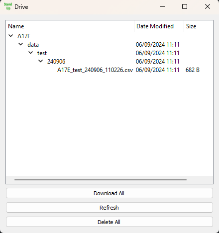

## [🏠 HOME](../README.md) | [🔧 Firmware](../Firmware/README.md) | [💻 Software](./README.md) | [📊 Analysis](../Analysis/README.md)

This project provides a set of Python scripts and user interfaces to interact with Google Drive, enabling users to clone, manage, and manipulate files and folders. The project consists of three primary components: `drive_cloner.py`, `drive_cloner_ui.py`, and `drive_ui.py`. These components work together to automate the process of downloading files from Google Drive, verifying their integrity, and removing them from the cloud once successfully downloaded.

## Scripts Overview

### 1. `drive_cloner.py`

This script interacts with Google Drive via the Google Drive API to manage files and folders. Given a folder ID, the script lists all files and folders within the specified folder, and based on their MIME types, downloads them to a local directory. If a folder is empty and is not the root, it deletes the folder from Google Drive. After downloading, it checks the integrity of the download using an MD5 hash and deletes the source file from Google Drive if the integrity check passes. The script also provides utility functions for listing and printing the folder structure in Google Drive, as well as deleting all files.

### 2. `drive_cloner_ui.py`

This script provides a Tkinter-based GUI application named "File Downloader" for downloading files from Google Drive. It allows users to specify a local directory to download files to, and it keeps the local directory synced with Google Drive by downloading files and removing them from Google Drive once successfully downloaded. The user can monitor progress and messages through a scrollable log window within the application interface.

### 3. `drive_ui.py`

 This script utilizes PySide2 to create a graphical user interface (GUI) application for interacting with Google Drive. The application enables users to browse, download, and delete files and folders in their Google Drive. The application is particularly equipped to handle these tasks while displaying progress and alerting users through a UI.

## Installation

### Prerequisites
- Python 3.7 or higher
- Required Python packages: Install using `pip install -r requirements.txt` or manually install the following packages:
  - `google-api-python-client`
  - `google-auth-httplib2`
  - `google-auth-oauthlib`
  - `requests`
  - `PySide2` (for `drive_ui.py`)
  - `tkinter` (for `drive_cloner_ui.py`)

### Setup
1. **Google API Credentials**:
   - Obtain a service account JSON file (`credentials.json`) from the Google Cloud Console (see [Firmware README](../Firmware/README.md) for more details).
   - Ensure the service account has the necessary permissions to access and modify your Google Drive files.
   
2. **Configuration**:
   - Ensure that the `drive_settings.ini` file is correctly set up with your desired download path if using `drive_cloner.py`.

## Usage

### Drive Cloner (Command Line)
- Simply run `drive_cloner.py` to start downloading files from Google Drive to the configured local directory. The script will automatically verify file integrity and delete files from Google Drive once successfully downloaded.

### Drive Cloner UI
- Launch the GUI with `drive_cloner_ui.py`. Use the buttons provided to start syncing your Google Drive content. The GUI will display progress and logs to keep you informed.

### Drive UI
- Start `drive_ui.py` to use the advanced interface, which allows for more granular control over your Google Drive files. You can browse, download, and delete files directly from the application.

## Acknowledgements

- **Google API Python Client** for providing the necessary tools to interact with Google Drive.
- **PySide2** and **Tkinter** for making GUI development accessible and straightforward.
